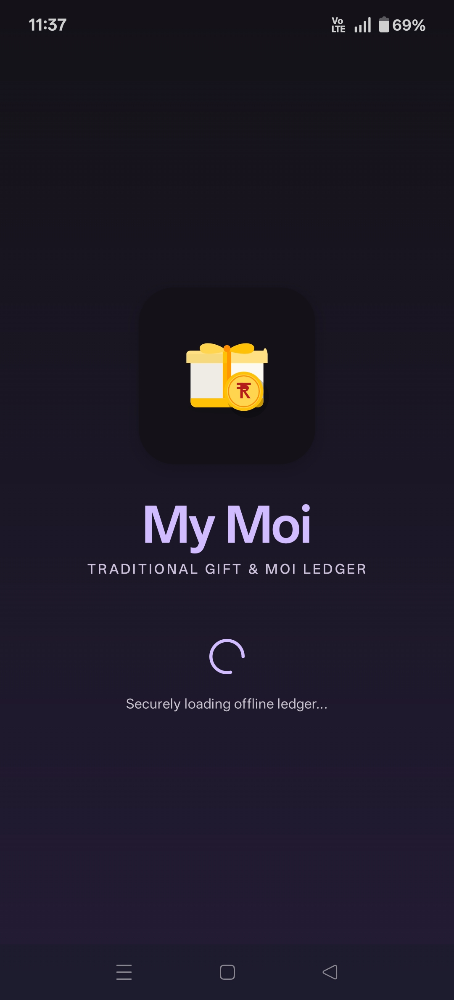
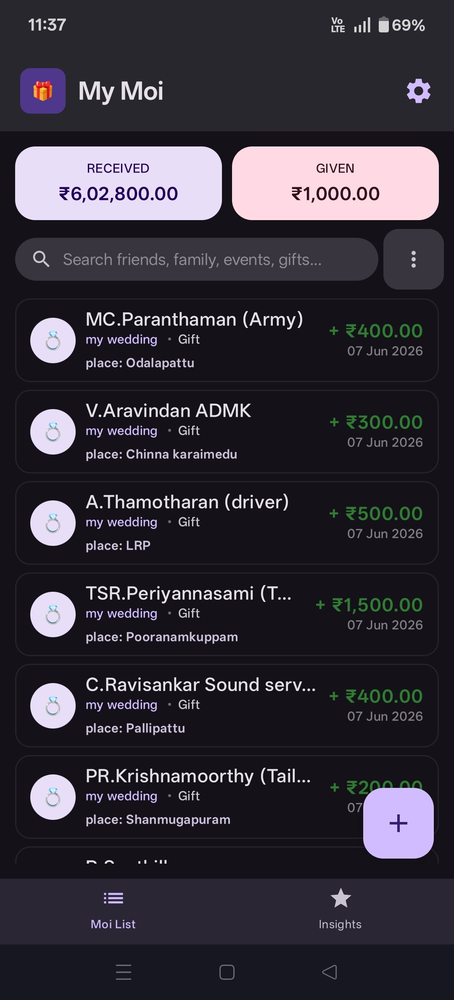
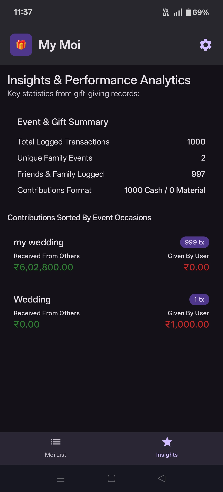
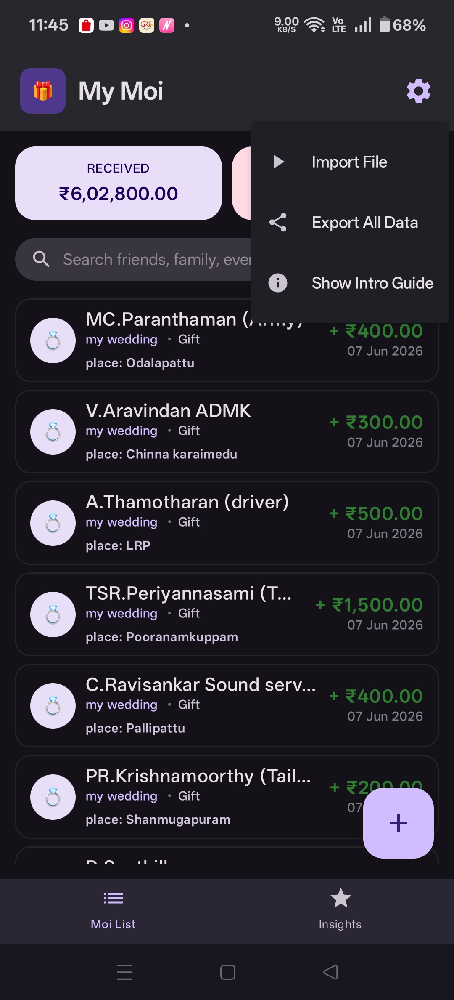
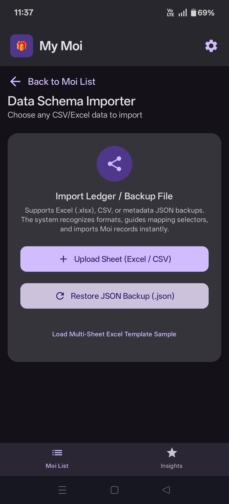
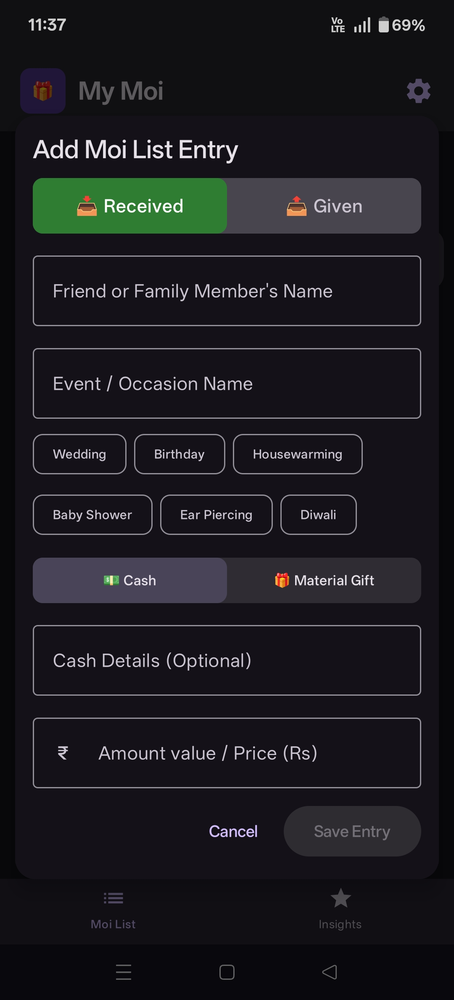
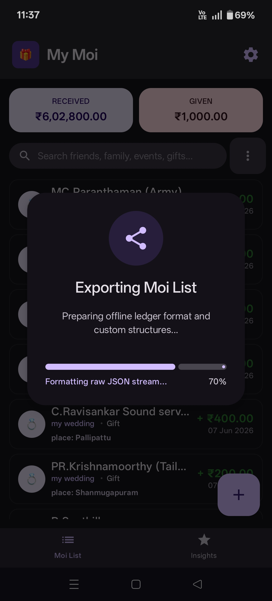

# Moi

Moi tracks gift-giving traditions. Log gifts and monetary contributions made or received during family events, import CSV histories with intuitive mapping, and search records cleanly.

## Screenshots

<div align="center">
  
  
  
  
  
  
  
</div>

## Prerequisites

- **Java JDK and Android SDK** installed and configured on your machine.
- An IDE of your choice (e.g., [Android Studio](https://developer.android.com/studio), IntelliJ IDEA, VS Code, or even Vim). You are not restricted to Android Studio!
- A physical Android device with **USB Debugging** enabled, connected via USB (or an active Android Emulator).

*(Note: You do not need to manually install any external project dependencies. The Gradle wrapper will automatically download and install all required libraries, such as Jetpack Compose and Room, the first time you run the build command.)*

## Getting Started: Clone, Compile, and Build

Follow these steps to clone the repository and build the app locally:

1. **Clone the repository:**
   Open your terminal and run:
   ```bash
   git clone https://github.com/jayaraj-kannan/my-moi.git
   cd my-moi
   ```

2. **Compile and Install (Debug) on Android Device:**
   Connect a physical Android device with **USB Debugging** enabled, or start an active Android Emulator. Run the following command from the project root to compile the app and install it onto your device:

   ```bash
   # On macOS/Linux:
   ./gradlew installDebug
   
   # On Windows:
   gradlew.bat installDebug
   ```
   *(If prompted with permissions for Gradle, accept them)*

3. Once the build completes successfully, look for the **Moi** app installed on your Android device and open it!

## Developing and Modifying the App

Because this is a standard Gradle-based Android project, you can open and edit this codebase using **any IDE or text editor**. 
If you are using an IDE like VS Code or IntelliJ IDEA, simply open the `my-moi` directory. Ensure you have the necessary Kotlin and Android extensions/plugins installed for the best experience.

## License

This project is licensed under the [MIT License](LICENSE).
